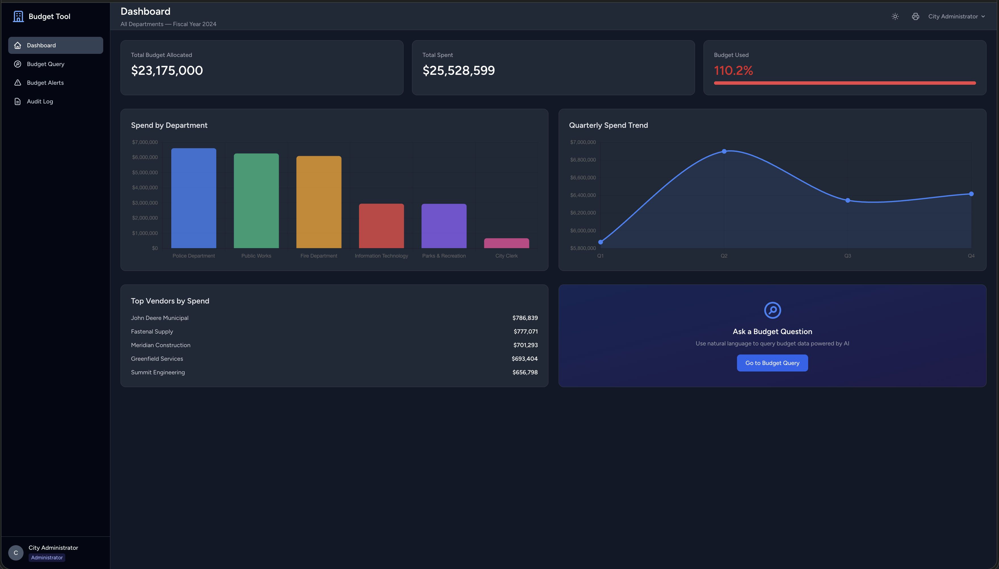
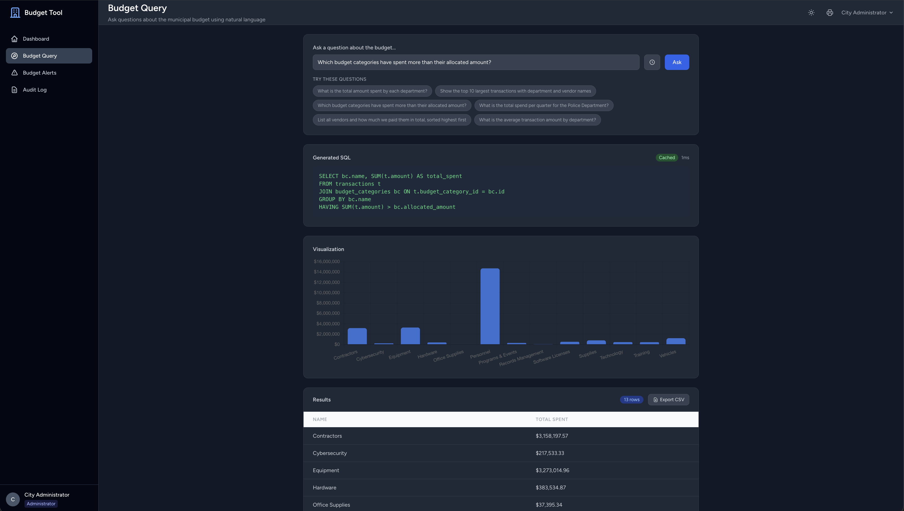
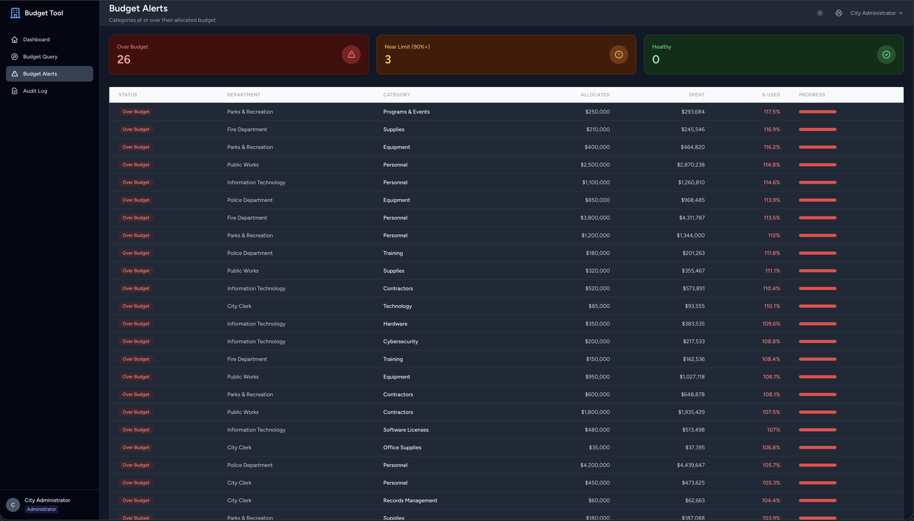

# Municipal Budget Query Tool

A full-stack web application that enables municipal government staff to explore and query budget data using natural language. Built as a portfolio project demonstrating modern full-stack development with AI integration.

The app uses a local LLM (Ollama + Llama 3.2) to convert plain-English questions like *"What is the total amount spent by each department?"* into executable SQL queries, returning results as interactive tables and auto-generated charts. Role-based access control ensures administrators see all departments while department heads are scoped to their own data.

## Tech Stack

| Layer | Technology |
|-------|-----------|
| **Backend** | Laravel 11, PHP 8.2+ |
| **Frontend** | Vue 3, Inertia.js |
| **Styling** | Tailwind CSS (with dark mode) |
| **Build Tool** | Vite |
| **Database** | SQLite |
| **AI / LLM** | Ollama + Llama 3.2 (runs locally, no API keys needed) |
| **Charts** | Chart.js via vue-chartjs |
| **Auth** | Laravel Breeze |

## Features

### Core
- **Natural Language to SQL** -- Ask budget questions in plain English; the local LLM generates and executes SQL queries in real time
- **Interactive Dashboard** -- Animated stat cards, spend-by-department bar chart, quarterly trend line chart, top vendors list
- **Role-Based Access Control** -- Admins see all 6 departments; department heads are scoped to their own department only
- **Auto-Generated Charts** -- Query results with numeric columns automatically render as bar charts

### Enhanced
- **Budget Alerts Page** -- At-a-glance view of categories that are over budget, near limit, or healthy
- **Audit Log** -- Admin-only page tracking every NL query with user, status, row count, and execution time
- **Query History** -- Recent queries panel with one-click replay
- **CSV Export** -- Download any query result set as a CSV file
- **Dark Mode** -- Toggle between light and dark themes (persisted in localStorage)
- **Print-Friendly** -- Clean print layout that hides navigation chrome
- **Query Caching** -- Identical questions are cached for 1 hour to avoid redundant LLM calls
- **Rate Limiting** -- 15 requests/minute on the query endpoint

## Prerequisites

- PHP >= 8.2
- Composer
- Node.js >= 18
- Ollama ([ollama.com](https://ollama.com))

## Setup Instructions

```bash
# 1. Clone and enter the project
git clone https://github.com/rayyankhann/municipal-budget-query-tool.git
cd municipal-budget-query-tool

# 2. Install dependencies
composer install
npm install

# 3. Environment setup
cp .env.example .env
php artisan key:generate

# 4. Create and seed the database
touch database/database.sqlite
php artisan migrate
php artisan db:seed

# 5. Pull the LLM model and start Ollama
ollama pull llama3.2
ollama serve

# 6. Start the development servers (in separate terminals)
php artisan serve    # Terminal 1 -- http://localhost:8000
npm run dev          # Terminal 2 -- Vite dev server
```

## Demo Credentials

| Role | Email | Password | Access Scope |
|------|-------|----------|-------------|
| Administrator | `admin@city.gov` | `password` | All 6 departments |
| Department Head | `parks@city.gov` | `password` | Parks & Recreation only |

## Database

Seeded with realistic municipal budget data across 6 departments:

- **Public Works**, **Parks & Recreation**, **Police Department**, **Fire Department**, **City Clerk**, **Information Technology**
- 29 budget categories with fiscal year 2024 allocations
- 1,100+ transactions with realistic vendors, descriptions, and amounts
- Some categories intentionally exceed their allocated budget to make queries interesting

## Project Structure

```
app/
  Http/Controllers/
    DashboardController.php    # Stats, charts, vendor data
    QueryController.php        # NL query, history, CSV export, suggestions
    BudgetAlertController.php  # Over/near budget category alerts
    AuditLogController.php     # Admin query audit trail
  Models/                      # Department, BudgetCategory, Transaction, QueryLog, User
  Services/
    OllamaService.php          # LLM integration with caching and safety validation
resources/js/
  Pages/
    Dashboard.vue              # Animated stat cards, charts, quick links
    Query.vue                  # NL input, suggestions, results table, chart, CSV export
    BudgetAlerts.vue           # Budget status overview with progress bars
    AuditLog.vue               # Paginated query audit trail
  Layouts/
    AuthenticatedLayout.vue    # Sidebar nav, dark mode toggle, print button
```

## Screenshots

### Dashboard
Animated stat cards, department spend bar chart, quarterly trend line, and top vendors at a glance.



### Budget Query
Ask questions in plain English -- the AI generates SQL, returns a results table, and auto-renders charts.



### Budget Alerts
Instantly see which categories are over budget, near their limit, or healthy.



## Note

Ollama must be running locally (`ollama serve`) with the `llama3.2` model pulled for the natural language query feature to work. No paid APIs, external services, or API keys are required -- everything runs on your machine.
